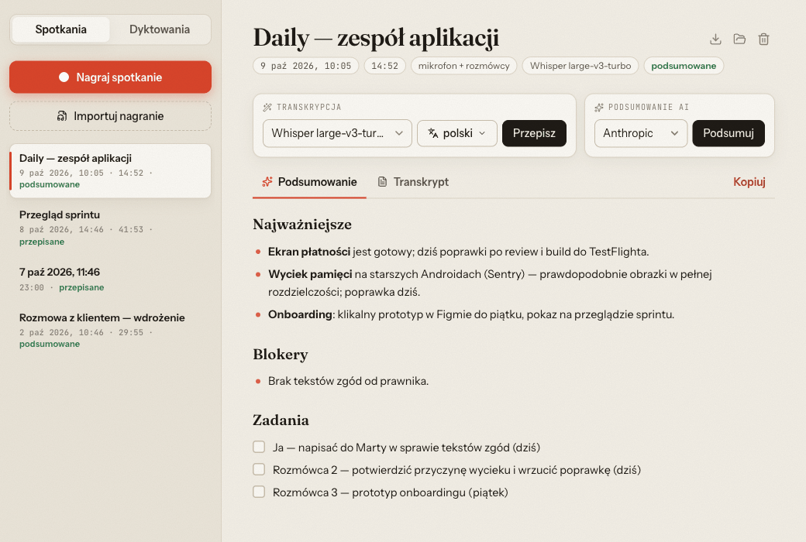
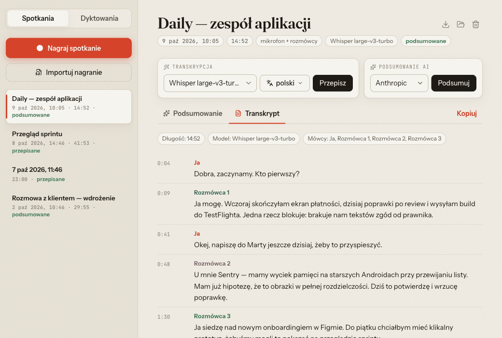
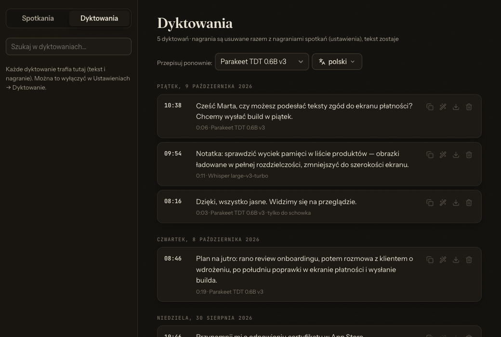
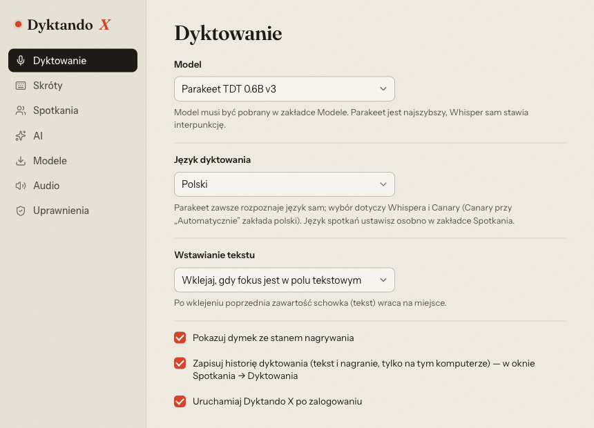

# Dyktando X

English | [Polski](README.pl.md)

Polish dictation and meeting recording for **macOS, Windows and Linux**. Speech recognition runs
locally and recordings never leave your computer. Only the transcript is sent to an AI provider,
and only when you ask for a summary.

Cross-platform version of [Dyktando for macOS](https://github.com/jash90/dyktando-mac) (Swift).
Tauri 2 + Rust + React/TypeScript.

## Features

- **Dictation:** hold a shortcut (F5 by default) or just the right ⌘/Ctrl key, say a sentence, and
  the text is pasted into the active field. Polish spoken commands ("kropka", "przecinek",
  "nowy akapit"…), capitalization, clipboard restore. When the focus is not in a text field, the
  text goes to the clipboard only.
- **Models** (downloaded inside the app):

  | Model | Engine | Size |
  |---|---|---|
  | Parakeet TDT 0.6B v3 (default) | ONNX | 670 MB |
  | Canary 1B v2 | ONNX | 1 GB |
  | Whisper large-v3-turbo | whisper.cpp | 1.6 GB |
  | Whisper large-v3 (q5_0) | whisper.cpp | 1.1 GB |

- **Meetings:** two tracks, your microphone and application audio (the other participants in Meet,
  Zoom, Teams). Live transcription while recording, shown in a small always-on-top window with the
  timer and signal levels of both tracks, optionally translated by Canary (between English and the
  other supported languages). After the recording, a full transcript with speaker labels ("Ja",
  "Rozmówca 1", "Rozmówca 2"…). A "Meeting detected — record?" prompt appears when a conferencing
  app starts using the microphone.
  Each track can be downloaded as a separate WAV file ("Mój głos" for your microphone,
  "Rozmówcy" for the other participants), or both mixed into one ("Całe nagranie").
  If a transcript came out poorly, re-transcribe the meeting with its language(s) set: one
  language, or several for a mixed conversation, in which case Whisper picks, for every
  utterance, the most likely of the chosen languages. Whisper knows ~100 languages, Parakeet and
  Canary the 25 European ones (Parakeet always detects the language itself, Canary needs exactly one).
- **Recording safety:** if the microphone or the application audio stops delivering sound during a
  meeting (device switched, Bluetooth headset, stream error), the source is recreated within a few
  seconds; unavoidable gaps are listed in the meeting. Logs are written to
  `~/Library/Logs/Dyktando X` (macOS) or `<data directory>/logs`.
- **Dictation history:** every dictation (text and recording) is kept locally in the "Dyktowania"
  tab of the meetings window, where it can be copied, downloaded or re-transcribed with another
  model or language.
- **Vocabulary:** names and terms that Whisper should spell correctly (settings → Spotkania).
- **Imported recordings:** "Importuj nagranie" turns an audio file of a conversation (MP3, M4A/AAC,
  WAV, FLAC, OGG Vorbis/Opus, AIFF, CAF) into a meeting: the file is decoded locally, transcribed
  with speaker labels ("Rozmówca 1", "Rozmówca 2"…) and, if enabled, summarized.
- **AI summaries:** Anthropic, OpenAI, OpenRouter, Z.AI. API keys are stored in the system
  credential store, and long meetings are summarized with map-reduce.

## Screenshots

| Meeting summary | Transcript |
|---|---|
|  |  |
| **Dictation history (dark)** | **Settings** |
|  |  |

## System requirements

| | Dictation | Application audio in meetings |
|---|---|---|
| macOS | 13+, Microphone and Accessibility permissions | 14.4+ (Core Audio process tap), "System Audio Recording" consent |
| Windows | 10/11 | Windows 11 or Windows 10 build 20348+ (WASAPI process loopback) |
| Linux (glibc 2.38+: Ubuntu 24.04, Debian 13, Fedora 39 and newer) | X11 and Wayland; shortcuts via `/dev/input` (udev rule in the .deb/.rpm package) | PulseAudio/PipeWire, the `parec` tool (pulseaudio-utils) |

On Wayland, pasting tries `wtype` (Sway, Hyprland), `dotool` and `ydotool` in that order. Without
them the text stays in the clipboard.

## Building

```bash
npm ci
npm run tauri dev                          # development mode
npm run tauri build                        # packages for the current OS
cd src-tauri && cargo test --lib           # unit tests
cargo test --lib -- --ignored synthetic_meeting   # meeting test (downloads models)
```

Linux needs: `libwebkit2gtk-4.1-dev libappindicator3-dev librsvg2-dev libasound2-dev
libdbus-1-dev libxdo-dev libclang-dev cmake`.

macOS: the app must be signed with the `com.apple.security.device.audio-input` entitlement
(`src-tauri/Entitlements.plist`). Without it, under hardened runtime the microphone returns silence.

## Releasing

Releases are built, signed and published locally with `scripts/release.sh`; `scripts/ci.sh`
runs the CI checks. See [RELEASING.md](RELEASING.md).

## Data

`<data directory>/DyktandoX/` contains `models/`, `settings.json` and `Meetings/<date>/`, each with
`meeting.json`, `audio/*.wav`, `transcript.md|json` and `summaries/`. Audio of transcribed meetings
is deleted after 30 days (configurable in settings); the text is kept.
